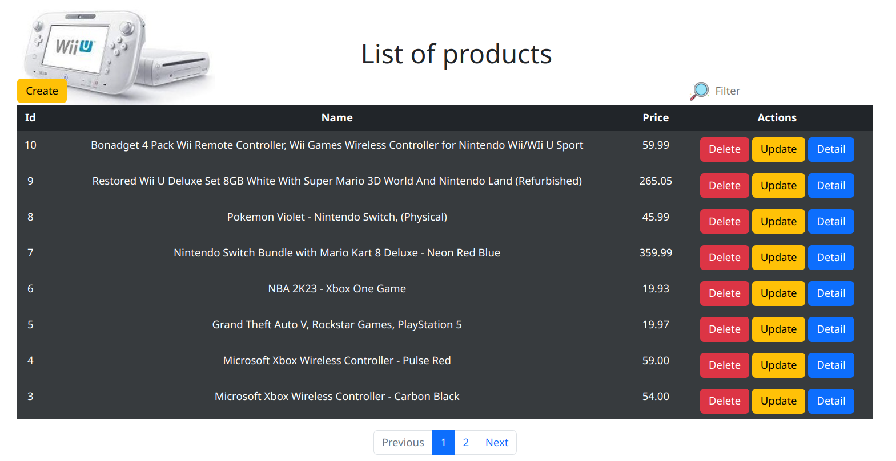

# <p align="center">Crud Django using CBV</p>

[crude]: https://www.codecademy.com/article/what-is-crud

[cbv]: https://docs.djangoproject.com/en/4.2/topics/class-based-views/

[django]: https://docs.djangoproject.com/en/4.2/

[python]: https://docs.python.org/3/

[html]: https://developer.mozilla.org/en-US/docs/Web/HTML

[css]: https://developer.mozilla.org/en-US/docs/Web/CSS

[javascript]: https://developer.mozilla.org/en-US/docs/Web/JavaScript

[bootstrap]: https://getbootstrap.com/

[my_github]: https://github.com/Kalebe614

#### <p align="center">A simple [CRUD][crude] application built with [Python][python] and [Django][django] using [CBV][cbv]</p>





## Contents

- [Technologies Used](#technologies-used)

- [Installation](#installation)

- [Credits](#credit)

- [Contact](contact)

## Technologies Used

- [Python][python]
- [Django][django]
- [HTML][html]
- [CSS][css]
- [Javascript][javascript]
- [Bootstrap][bootstrap]
## Installation

<p>1. Clone the repository:

```
https://github.com/Kalebe614/django-CRUD.git
```

</p>

<p>
2. Navigate to the project directory:

```
cd DJANGO-CRUD  
```
</p> 
 
<p>
3. Install the dependencies:

```
pip install -r requirements.txt
```
</p>
<p>
4. Run the database migrations:

```
python manage.py migrate
```
</p>
<p>
5. Execute the project:

```
python manage.py runserver
```
</p>
<p>
Now you can open: http://localhost:8000 or http://127.0.0.1:8000 to view it in the browser.
</p>

## Credits
CRUD app was built by [Kalebe de Oliveira][my_github]
##Contact

- Email: <a ref="mailto:kalebe613@gmail.com">kalebe613@gmail.com</a>
- [GitHub](https://github.com/Kalebe614)
>>>>>>> 6d719e8 (Update README.md)
